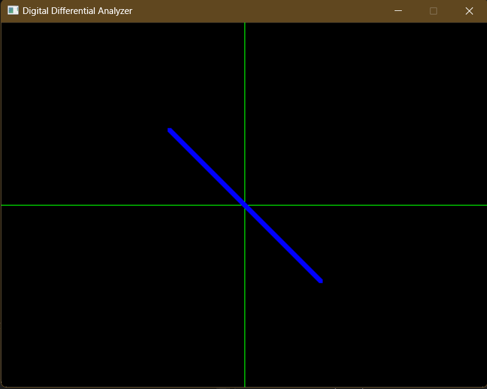
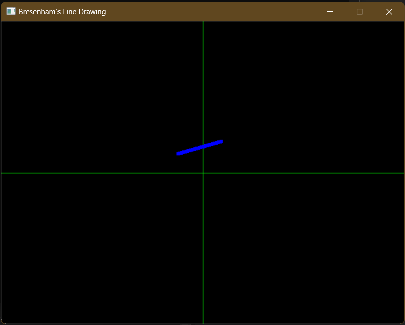
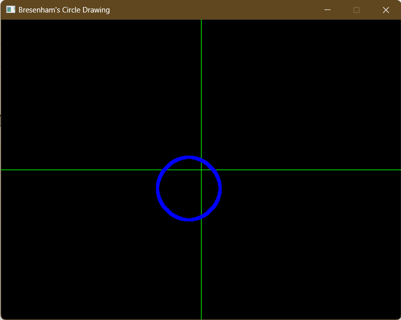

# Computer Graphics Algorithms with SDL-2

## Line Drawing Algorithms
### 1) Digital Differential Analyzer
 

 
 

### 2) Bresenham's Line Drawing Algorithm
 

 

## Circle Drawing Algorithms
 

### 1) Bresenham's Circle Drawing Algorithm
 

